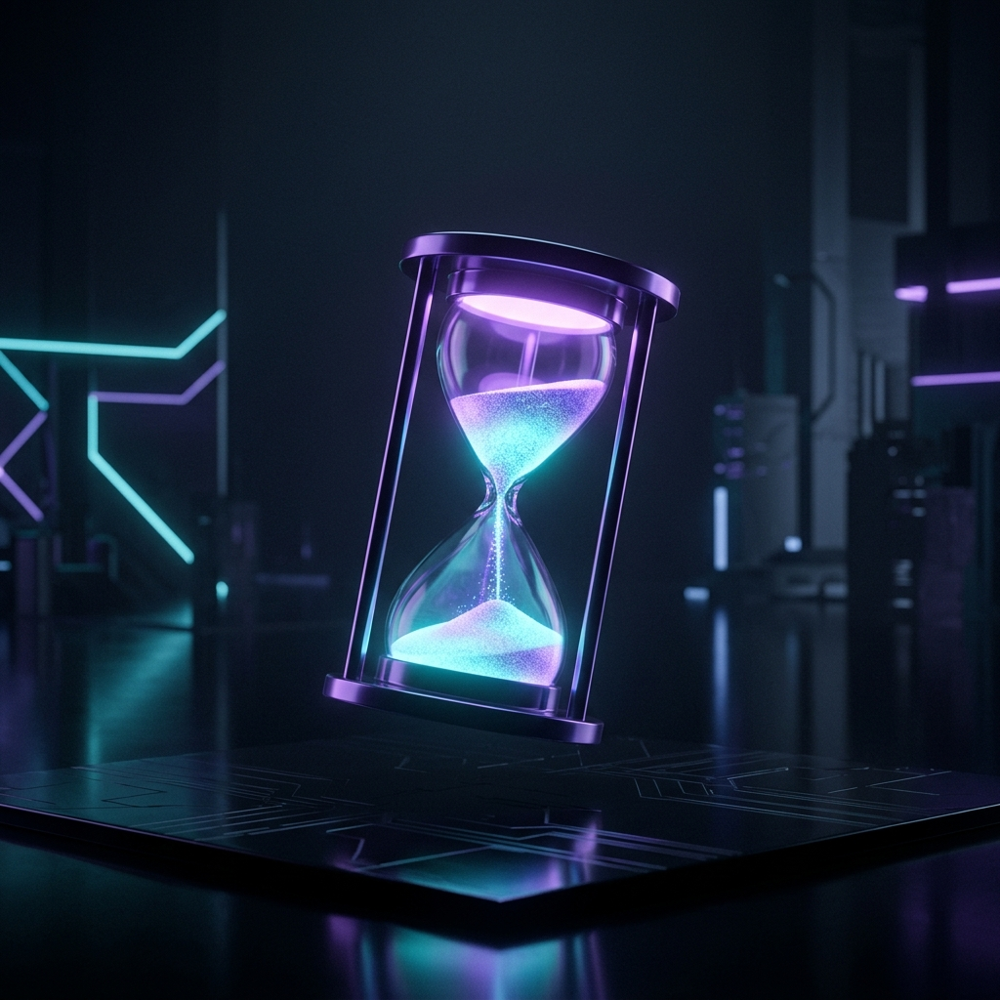

# README.md
<div align="center">
  
  
  <br/>

  <h1>🧘‍♂️ zen</h1>
  <p><b>Minimalist Terminal Deep-Work Timer</b></p>
  <i>Simple terminal app for focus sessions. No GUI, just flow.</i>

  <br/>
  
  [](https://python.org)
  [](LICENSE)
</div>

---

## 📑 Table of Contents
- [🌟 Overview](#-overview)
- [🚀 Enterprise Features](#-enterprise-features)
- [⚡ Quick Start Guide](#-quick-start-guide)
- [💻 Comprehensive Usage](#-comprehensive-usage)
- [🤝 Contributing](#-contributing)

---

## 🌟 Overview

**zen** is an ultra-minimalist, distraction-free terminal application built to safeguard developer focus. It ditches complex GUIs in favor of beautiful, native terminal progress indicators. Dive straight into flow state.

---

## 🚀 Enterprise Features

- **🌊 Flow State**: Visually stunning, distraction-free TUI progress bar.
- **⏱️ Flexible**: Fully configurable focus sessions and break reminders.
- **🎨 Premium Aesthetic**: Powered by `Rich` and `Typer` to look incredible in any modern terminal emulator (iTerm, Kitty, Windows Terminal).
- **🚀 Performance**: Lightning-fast startup with lazy-loaded imports and zero-overhead UI rendering.

---

## ⚡ Quick Start Guide

### Installation

Install via pip:
---

## 💻 Comprehensive Usage

### Start a Session
To start a default 25-minute Pomodoro session:
### Advanced Usage

**zen** supports additional CLI flags to customize your workflow:

- **`--break`**: Run the timer as a break session instead of a focus session. Ideal for timing your rest periods between deep work blocks.
  ```bash
  zen 5 --break
  ```

- **`--silent`**: Run the timer without sending desktop notifications upon completion. Perfect for environments where notifications are distracting or unsupported.
  ```bash
  zen 25 --silent
  ```

You can also combine these flags for a silent break session:
---

## 🤝 Contributing
Want to help safeguard developer focus? Let's flow together! 🌊
- 🐛 **Found a bug?** Open an issue to let us know.
- ✨ **Have a feature idea?** We are open to PRs! Keep the UI minimal and the code beautiful.
- 🎨 **Documentation tweaks?** Always welcome!

---
> *Crafted by a Vibe Coder. Protect your focus.*
